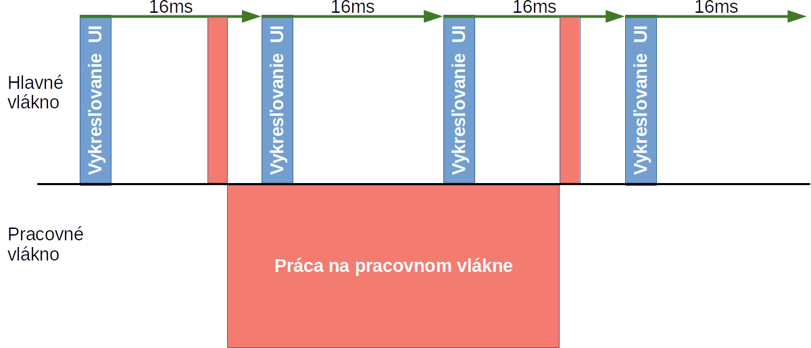
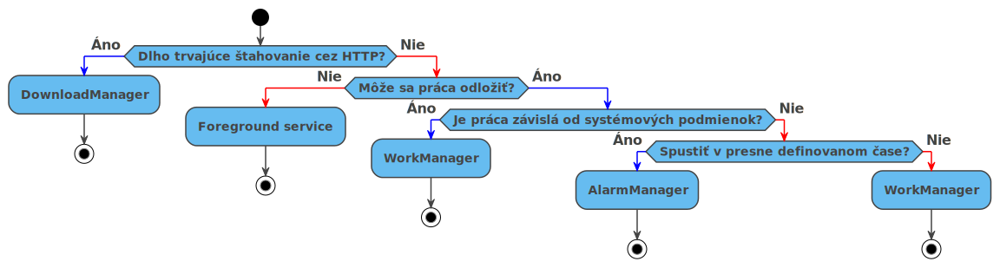

# Procesy a vlákna <small>(multithreding)</small>

[Android develoment ](https://developer.android.com/guide/components/processes-and-threads)


Pri spustení aplikácie Android OS spustí nový proces (Linux) s jedným vláknom.  Štandardne všetky komponenty aplikácie bežia na rovnakom procese v tzv. "hlavnom" vlákne v Android-e tiež nazývané UI vlákno. Toto štandardné správanie sa dá ovplyvniť v manifeste `AndroidManifest.xml` a takisto v každom procese je možné vytvoriť ďalšie vlákna. 


## Procesy

V predvolenom nastavení sú všetky komponenty tej istej aplikácie spustené v rovnakom procese a väčšina aplikácií by to nemala meniť. Ak však je potrebné zmeniť zaradenie do ktorého procesu daná komponenta patrí, môžeme tak spraviť v súbore `AndroidManifest.xml`:

- Komponenty ako`<activity>, <service>, <receiver>, <provider>` podporujú atribút `android:process`, pomocou ktorého môžeme upraviť v akom procese majú komponenty bežať (vlastný proces, zdielaný proces). 
- Komponent `<application>` umožňuje nastaviť atribút `android:process`, ktorým sa nastaví predvolená hodnota. 

V prípadoch kedy Android potrebuje uvolniť HW prostriedky alebo šetriť energiou  sa môže rozhodnúť nečinné procesy zastaviť. Ak niektoré zastavané komponenty majú opätovne pridelenú prácu tak sú znova spustené v procese.

Pre správne fungovanie aplikácie je potrebné správne implementovať životný cyklus procesu (predchádzajúce prednášky a cvičenia).  

## Vlákna
Pri spustení aplikácie systém vytvorí pre aplikáciu vlákno, ktoré sa nazýva hlavné vlákno alebo niekedy tiež "UI" vlákno. Toto vlákno je dôležité, pretože má na starosti odosielanie udalostí na príslušné komponenty užívateľského rozhrania. Dané vlákno je zodpovedné aj za samotné vykresľovanie UI. Za zvláštnych okolností však hlavné vlákno aplikácie nemusí byť totožné s UI vláknom. Ako je však uvedené v dokumentácii, rozdiel je dôležitý iba v súvislosti s niektorými systémovými aplikáciami (aplikáciami, ktoré sú spustené ako súčasť OS). Ďalšie informácie sa nachádzajú v téme [Annotations Thread](https://developer.android.com/studio/write/annotations#thread-annotations).

### Hlavné "UI" vlákno
Hlavné vlákno má jednoduchý dizajn: Jeho jedinou úlohou je čakať na pridelenie úlohy z pracovnej fronty a  následne jej vykonanie. Tieto úlohy prichádzajú z rôznych zdrojov ako napr. udalosti späté zo životným cyklom aplikácie, udalosti od užívateľského rozhrania, udalosti od ostatných aplikácií. Pridelená úloha sa spracováva v rôznych obslužných metódach ako napr.:

- v obslužných metódach  životného cyklu `onStart(),onResume(),onRestart(), onCreate(),onPause(),onStop(), onDestroy() `, atď 

- v obslužných metódach užívateľského rozhrania `onClick(), onKeyDown() `, atď
> Ukážka činnosti hlavného vlákna
> 

  Hlavné vlákno má tiež za úlohu v pravidelných intervaloch vykresľovať užívateľské rozhranie (každých 16ms čo je 60Hz). Ak hlavné vlákno vykonáva nejakú časovo náročnú úlohou alebo je zahltené veľkým množstvom udalostí na spracovanie tak užívateľské rozhranie môže byť spomalené.  Ak hlavné vlákno sa zablokuje približne na päť sekúnd, systém zobrazí dialógové okno: [*aplikáciu neodpovedá*](https://developer.android.com/training/articles/perf-anr) (ANR), ktoré umožňuje používateľovi zatvoriť aplikáciu.

> Normálna činnosť hlavného vlákna
> 
------
> Zablokovanie hlavného vlákna
> 
------
> Presunutie náročenej operácie na pracovné vlákno
 
------
> Ak hlavné vlákno sa zablokuje približne na päť sekúnd, systém zobrazí dialógové okno
 

Najväčším dôvodom na zavádzanie vlákien do aplikácie je presun výpočtovo náročných úloh z hlavného vlákna preto, aby neovplyvňovali plynulosť vykresľovania a rýchlosť reakcie na vstup používateľa. Vlákna, ktoré odbremeňujú hlavné vlákno, budeme nazývať *pracovnými vláknami*. 


Prístup k metódam užívateľského rozhrania nie je s pohľadu viacvláknovej aplikácie bezpečný a teda priamy prístup k týmto metóda z iného vlákna ako je hlavné vlákno je zakázaný.    

!!! note "StrictMode – nástroj na detekciu omylov v kóde, ktoré môžu spôsobovať ANR hlášky [](https://developer.android.com/reference/android/os/StrictMode)" 
	StrictMode je nástroj pre vývojárov, ktorý má za úlohu upozorňovať na chyby z nepozornosti aby ste ich mohli opraviť.
	

	StrictMode sa najčastejšie používa na odhalenie náhodného prístupu na disk alebo do siete v hlavnom vlákne aplikácie, kde sa štandardne vykonávajú iba operácie týkajúce sa užvatelské rozhrania. Udržiavanie diskových a sieťových operácií mimo hlavného vlákna má pozitívny vplyv na plynulosť a rýchlu odozvu aplikácie.  
	``` Java
	public void onCreate () { 
	     if (DEVELOPER_MODE) { 
	         StrictMode.setThreadPolicy (new ThreadPolicy.Builder() 
	                 .detectDiskReads () 
	                 .detectDiskWrites () 
	                 .detectNetwork () // or .detectAll () pre všetky zistiteľné problémy 
	                 .penaltyLog () 
	                 .build () ; 
	         StrictMode.setVmPolicy (new VmPolicy.Builder() 
	                 .detectLeakedSqlLiteObjects () 
	                 .detectLeakedClosableObjects () 
	                 .penaltyLog () 
	                 .penaltyDeath () 
	                 .build ()); 
	     } 
	     super.onCreate (); 
	 }
	 
	```

!!! note "Vylepšite kontrolu kódu pomocou anotácií [](https://developer.android.com/studio/write/annotations#thread-annotations)"
	Android podporuje množstvo anotácií prostredníctvom [Knižnice podpory anotácií](https://developer.android.com/topic/libraries/support-library/features#annotations) . Knižnicu môžete získať prostredníctvom `android.support.annotation` balíka.<br>
	Ak chcete do svojho projektu pridať knižnicu na podporu anotácií, do `dependencies` bloku v súbore `build.gradle` pridajte nasledujúci riadok a zosynchronizujte projekt:
	```Groovy
    dependencies {
        implementation 'com.android.support:support-annotations:28.0.0'
    }
    ```
    Ak chcete spustiť kontrolu kódu z Android Studia, ktorá zahŕňa overenie anotácií a automatickú kontrolu pomocou programu Lint, na paneli s ponukami vyberte **Analyzovať** > **Skontrolovať kód** ( **Analyze** > **Inspect Code**).
	
	!!! warning "Upozorňujeme, že hoci konflikty anotácií generujú upozornenia, tieto upozornenia nebránia kompilácii aplikácie."


    **Najčastejšie používané anotácie anotácii:**
    
    - Kotrola null hodnôt:
    	- [@Nullable](https://developer.android.com/reference/androidx/annotation/Nullable)
    [@NonNull](https://developer.android.com/reference/androidx/annotation/NonNull)
    - Anotácie zdrojov:
    	- napr. [@DrawableRes, @DimenRes, @ColorResa @InterpolatorRes, @StringRes](https://developer.android.com/studio/write/annotations#res-annotations)
    - Anotácie na obmedzenie vstupných hodnôt
    	- napr. [@IntRange, @FloatRangea, @Size](https://developer.android.com/studio/write/annotations#value-constraint)
    - Anotácie k povoleniam
        - napr. [@RequiresPermission](https://developer.android.com/studio/write/annotations#permissions)
    - **Anotácie na kontrolu, či sa metóda volá z konkrétneho typu vlákna**
        -   [@MainThread](https://developer.android.com/reference/androidx/annotation/MainThread)
        -   [@UiThread](https://developer.android.com/reference/androidx/annotation/UiThread)
        -   [@WorkerThread](https://developer.android.com/reference/androidx/annotation/WorkerThread)
        -   [@BinderThread](https://developer.android.com/reference/androidx/annotation/BinderThread)
        -   [@AnyThread](https://developer.android.com/reference/androidx/annotation/AnyThread) 
    - Ostatné si možete dohladať [tu](https://developer.android.com/studio/write/annotations)	
Ako už bolo písané v predchádzajúcich odsekoch na hlavnom vlákne sa nesmú vykonávať časovo náročné úlohy, ktoré by mohli toto vlákno zablokovať. Všetky náročnejšie úlohy by sa mali vykonávať na pracovných vláknach, ktoré sú riadené z hlavného vlákna.  Treba pripomenúť, že práca z užívateľským rozhraním je dovolená iba z hlavného vlákna. 

Na vyriešenie problému s prístupom k užívateľskému rozhranie mimo hlavného vlákna Android poskytuje viacero možností: 

- [`Activity.runOnUiThread(Runnable)`](https://developer.android.com/reference/android/app/Activity#runOnUiThread(java.lang.Runnable))

- [`View.post(Runnable)`](https://developer.android.com/reference/android/view/View#post(java.lang.Runnable))

- [`View.postDelayed(Runnable, long)`](https://developer.android.com/reference/android/view/View#postDelayed(java.lang.Runnable,%20long))

> Príklad aktualizácie užávateľského rozhrania z pracovného vlákna pomocu odoslania `Runnable` objektu
>	``` java
    public void onClick(View v) {
        new Thread(new Runnable() {
            public void run() {
                // potenciálne časovo náročná úloha
                final Bitmap bitmap =
                        processBitMap("image.png");
                imageView.post(new Runnable() {
                    public void run() {
                        imageView.setImageBitmap(bitmap);
                    }
                });
            }
        }).start();
    }
    ```
    Operácia úpravy  obrázku sa vykonáva zo samostatného vlákna, zatiaľ čo s objektom `ImageView`sa vždy manipuluje z hlavného vlákna (UI).
    ```

Z rastúcou zložitosťou aplikácie môže priame používanie vláken byť kompilované a neprehľadné. Android poskytuje efektívnejšie spôsoby ako pracovať s úlohami na pozadí: 

- Vykonanie náročných výpočtov na pozadí za pomoci `service` komponenty systému a využitia notifikácii (`notifications`) pre informovanie používateľa. 
	- `IntentService, Foreground service`
- Vykonanie náročných výpočtov pomocou *vlákna*. Spolupráca a komunikácia medzi vláknami je možná pomocou obslužných *Handler* objektov a posielania *Runnable* objektov.
	- `AsyncTask, AsyncTaskLoader, HandlerThread, ThreadPool`
- Špecializované knižnice 
	- `WorkManager, AlarmManager, DownloadManager`

### Nastavenie priority

Priorita, ktorú dostanú vlákna v aplikácií, závisí čiastočne od toho, kde sa aplikácia nachádza v životnom cykle aplikácie. Pri vytváraní a správe vlákien je dôležité nastaviť ich prioritu. Ak je nastavená príliš vysoko, vaše vlákno môže prerušiť vlákno UI a RenderThread, čo môže spôsobiť, že aplikácia vynechá rámce pri vykresľovaní UI. Opačný extrém je ak je nastavená príliš nízka priorita, čo môže spôsobiť, že asynchrónne úlohy (napríklad načítanie obrázkov) budú príliš spomalené. 

Vždy, keď je vytvorené nové vlákno je vhodné zavolať `setThreadPriority()` a nastaviť vláknu vhodnú prioritu tak aby plánovač  vybalancoval vytaženie CPU. Pre jednoduchšie zvolenie správnej priority existujú pomocné konštanty cez ktoré môžete zvoliť správnu prioritu viď. tabuľka nižšie. Napríklad `THREAD_PRIORITY_DEFAULT` predstavuje predvolenú hodnotu pre vlákno. Aplikácia by mala nastaviť prioritu `THREAD_PRIORITY_BACKGROUND` pre vlákna, ktoré vykonávajú menej naliehavú prácu.

Vlákna, ktoré sú v aplikácii, ktorá je v  [popredí zvyčajne získavajú asi 95% procesného času](https://www.youtube.com/watch?v=NwFXVsM15Co&list=PLWz5rJ2EKKc9CBxr3BVjPTPoDPLdPIFCE&index=9), zatiaľ čo vlákna v aplikácii v pozadí získavajú iba zhruba 5%.

V predvolenom nastavení systém nastaví prioritu vlákna na rovnakú prioritu a členstvo v skupine ako vlákno, ktoré vytvorilo nové vlákno.

|       | Konštanta |
| ----- | ------------------------------------------------------------ |
| `int` | `THREAD_PRIORITY_AUDIO`Standard priority of audio threads.   |
| `int` | `THREAD_PRIORITY_BACKGROUND`Standard priority background threads. |
| `int` | `THREAD_PRIORITY_DEFAULT`Standard priority of application threads. |
| `int` | `THREAD_PRIORITY_DISPLAY`Standard priority of system display threads, involved in updating the user interface. |
| `int` | `THREAD_PRIORITY_FOREGROUND`Standard priority of threads that are currently running a user interface that the user is interacting with. |
| `int` | `THREAD_PRIORITY_LESS_FAVORABLE`Minimum increment to make a priority less favorable. |
| `int` | `THREAD_PRIORITY_LOWEST`Lowest available thread priority.    |
| `int` | `THREAD_PRIORITY_MORE_FAVORABLE`Minimum increment to make a priority more favorable. |
| `int` | `THREAD_PRIORITY_URGENT_AUDIO`Standard priority of the most important audio threads. |
| `int` | `THREAD_PRIORITY_URGENT_DISPLAY`Standard priority of the most important display threads, for compositing the screen and retrieving input events. |
| `int` | `THREAD_PRIORITY_VIDEO`Standard priority of video threads.   |


Viac informácií o správe vlákien nájdete v referenčnej dokumentácii o triedach `Thread`a `Process`[](https://developer.android.com/guide/topics/processes/process-lifecycle).

### Pomocné triedy pre prácu z vláknami

#### AsyncTask [](https://developer.android.com/reference/android/os/AsyncTask)

AsyncTask trieda je jednoduchá a užitočná pomôcka pre aplikácie, ktoré potrebujú rýchlo presunúť prácu z hlavného vlákna na pracovné vlákna. Napríklad ak nejaká vstupná udalosť vyvolá akciu kde je treba  načítať obrázok a následne aktualizovať používateľské rozhranie . Použitím AsyncTask triedy  sa jednoduchým spôsobom môže presunúť bremeno sťahovania a dekódovania obrázku na pomocné pracovné vlákno a následne AsyncTask trieda zabezpečí odovzdanie výsledku hlavnému vláknu, ktoré môže pristupovať k užívateľskému rozhraniu.

Pri používaní AsyncTask je potrebné pamätať na niekoľko dôležitých aspektov: 

- V predvolenom nastavení všetky vytvorené AsyncTask objekty zdieľajú jedno spoločné vlákno. Preto ak je v jednom momente spustených viacej AsyncTask-ov v skutočnosti sa spúšťajú sériovo. Pri tejto štandardnej konfigurácie platí odporúčanie, aby jednotlivé  AsyncTask úlohy vedeli svoju činnosť dokončiť do  5 ms a tým neblokovali príliš dlho spoločné vlákno. 
    - V prípade, že potrebujete vykonanie viacero AsyncTaskov paralelne môžete tak docieliť nastavením iného executora: ` executeOnExecutor (java.util.concurrent.Executor, Object []) s THREAD_POOL_EXECUTOR.`  
- AsyncTask úlohy sú tiež najčastejšími páchateľmi problémov s [implicitnými referenciami](https://developer.android.com/topic/performance/threads#implicit).
- AsyncTask úlohy tiež predstavujú riziká spojené s explicitnými referenciami, ale v niektorých prípadoch je ich možné ľahko vyriešiť. Napríklad AsyncTask môže držať referenciu na objekt užívateľského rozhrania(typ `View`), táto referencia sa používa na aktualizáciu užívateľského rozhrania. Akonáhle AsyncTask dokončí svoju prácu odovzdá referenciu tohoto objekt hlavnému vláknu, kde sa použije na aktualizáciu užívateľského rozhrania. V takejto situácii môže dochádzať k memory leak-u, kedy udržiavaná referencia bude ukazovať na objekt, ktorý už nie je používaný. Na vyriešenie tohoto problému môžeme  použiť `WeakReference` na uloženie referencie na požadovaný objekt používateľského rozhrania a na prístup k objektu.

AsyncTask je definovaná týmito prvkami:

| **3 generické typy**                 | **4 základné stavy**                                         | **1 pomocná metóda** |
| ------------------------------------ | ------------------------------------------------------------ | -------------------- |
| Vstupné parametre, Progres, Výsledok | `onPreExecute, doInBackground, onProgressUpdate,onPostExecute` | `publishProgress`    |

| **Popis**                                                    | **Vlákno na ktorom sa vykonáva kód** |
| :----------------------------------------------------------- | ------------------------------------ |
| `onPreExecute()` spustené na UI vlákne okamžite po spustení úlohy. Táto metóda sa používa na prípravu úlohy, ako napríklad pripravenie užívateľského rozhrania(napr. zobrazenie progres-baru na používateľskom rozhraní). | hlavné "UI" vlákno                   |
| `doInBackground(Params...)` spustené na vlákne pracujúcom v pozadí hneď po `onPreExecute()` skončí svoju činnosť. V tejto metóde sa vykonáva práca, ktorá má bežať na pozadí. V tejto metóde môžeme volať `publishProgress(Progress...)`, pomocou ktorej sa publikujú priebežné výsledky. | pracovné vlákno                      |
| `onProgressUpdate(Progress...)` spustené na UI vlákne po zavolaní `publishProgress(Progress...)` metódy. Čas vykonania nie je definovaný. Táto metóda slúži na zobrazenie hocijakej formy progresu v užívateľskom rozhraní. | hlavné "UI" vlákno                   |
| `onPostExecute(Result)` spustené na UI vlákne po ukončení úlohy na pozadí. | hlavné "UI" vlákno                   |

> Ukážka interakcie hlavného vlákna s AsyncTask vláknom 
> 
-----
> Príklad použitia:
> ``` Java
> private class VerySlowTask extends AsyncTask<String, Long, Void> {
>     // Begin - can use UI thread here
>     protected void onPreExecute() {
>     }
>     // this is the SLOW background thread taking care of heavy tasks
>     // cannot directly change UI
>     protected Void doInBackground(final String... args) {
>     ... publishProgress((Long) someLongValue);
>     }
>     // periodic updates - it is OK to change UI
>     @Override
>     protected void onProgressUpdate(Long... value) {
>     }
>     // End - can use UI thread here
>     protected void onPostExecute(final Void unused) {
>     }
> }
> ```

**Zrušenie úlohy**

Zrušiť úlohu môžete v ľubovoľnom čase zavolaním metódy `cancel(boolean)`. Po zavolaní metódy `cancel()` sa vyvolá funkcia `onCancelled(Object)`, až po ukončení práce vo funkcii `doInBackground(Object[])`. Pre urýchlenie ukončenia úlohy treba vo funkcii `doInBackground(Object[])` periodicky kontrolovať návratovú hodnotu z `isCancelled()`.

!!! warning "Od verzie API level R je AsyncTask trieda označená ako deprecated"

#### HandlerThread

Aj keď AsyncTask je užitočný, nemusí byť vždy tým správnym riešením problému pre prácu s vláknami. V niektorých prípadoch je potrebné alebo vhodnejšie použiť tradičnejší prístup, v ktorom existuje pracovné vlákno, ktoré ma dlhú životnosť a tomuto vláknu sú prideľované pracovné bloky, ktoré sú na ňom vykonávané.  

Uvažujme o prípade kedy získavame snímky z kamery pomocou  `Camera` objektu. Po zaregistrovaní požiadavky na príjem  snímok  s náhľadom kamery, dostávame ich v `onPreviewFrame()` spätnom volaní, ktoré sa vyvolá na vlákne, z ktorého bolo zaregistrované. Ak by sa toto spätné volanie vyvolalo na hlavnom vlákne "UI" , náročná úloha spracovania obrázkov by potencionálne mohla narušiť plynulé vykresľovanie a spracovaním udalostí. Rovnaký problém sa týka aj tých AsyncTask-ov, ktoré tiež svoje úlohy vykonávajú sériovo a môžu v prípravnej fáze(`onPreExecute()` spustené na hlavnom vlákne) zablokovať hlavné vlákno, ktoré ich vytvára.

Toto je situácia, keď by bolo vhodné použiť `HandlerThread`: vlákno obsluhy je efektívne dlhodobo prebiehajúce vlákno, ktoré odoberá pracovné bloky vo forme `Runnable` objektu zo zásobníka, ktorý je sním spätý. V tomto prípade, keď aplikácia deleguje `Camera.open()` príkaz na pracovné vlákno, tak v tomto priradené  spätné volanie `onPreviewFrame()` bude vykonávané práve na tomto pracovnom vlákne, tým pádom UI vlákno je odbremenené. 

Keď aplikácia vytvorí vlákno pomocou `HandlerThread`, netreba zabúdať na nastavenie správnej priority vlákna na základe charakteru vykonávanej práce. 

!!! note "Poznámky na zváženie pri práci s HandlerThread"
	- HandlerThread-y bežia mimo životného cyklu aktivity, takže sa nesmie zabudnúť na ich správne ukončenie  ak už niesu potrebné, inak môže dochádzať k nechcenému vytváraniu nových vlákien. Toto je obzvlášť nebezpečné, ak sa používajú pre dlhodobo prebiehajúce procesy. 
	- Neexistuje žiadny podobný mechanizmus na spätné odosielanie výsledkov do hlavného vlákna ako je tu v prípade AsyncTask-u. To znamená viac kódu, ktorý je potrebné písať.

##### Práca s HandlerThread
Pri práci s HandlerThread je potrebné vytvoriť a prepojiť zásobník správ a úloh, z ktorého si bude HandlerThread odoberať úlohy pre svoju činnosť. Táto fronta je tvorená objektom `Handler`.

``` Java
HandlerThread handlerThread = new HandlerThread ("MyHandlerThread"); 
handlerThread.start (); 
Looper looper = handlerThread.getLooper (); 
Handler handler = new Handler (looper);
```

Ako prvé vytvoríme nový HandlerThread a pomenujeme ho. Potom spustíme HandlerThread, získame Looper pre HandlerThread a odovzdáme ho Handler-ovi

#####Zásobník správ - Handler

Vlákno, ktoré chce komunikovať s hlavným vláknom alebo `HandlerThread` vláknom si musí vyžiadať token za pomoci metódy `obtainMessage()`. Po obdržaní tokenu môže vlákno naplniť dáta do token objektu  a za pomoci metódy `sendMessage()` tento token zaradiť do zásobníka správ. Vytvorený `Handler` volá metódu `handleMessage()` po prijatí novej správy. Správa odobratá zo zásobníka správ obsahuje dáta alebo požiadavku na vykonanie `Runnable` objektu vložného pomocou metódu `post()`.

> Mechanizmus odovzdania `Runnable` objektu alebo správy. `Runnable` objekt predstavuje pracovný blok, ktorý sa má vykonať na vlákne príjemcu (pracovné vlákno alebo hlavné vlákno). 
> 
-----
> **Inicializácia vlákna a handlera v hlavnom vlákne**
>
> ```java
> //Inicializácia handler vlákna 
> final HandlerThread backJob = new HandlerThread("Vlakno casovaca");
> backJob.start(); //Spustenie vlákna
> 
> //Pridelenie looper slučky do Handler triedy
> Looper mLooper = backJob.getLooper();
> mHandler = new MyHandler(mLooper);
> ```
------
> **Vytvorenie triedy handlera**
>
> ```java
> // Handler pre HandlerThread
> class MyHandler extends Handler {
> 	public MyHandler(Looper myLooper) {
> 		super(myLooper);
> 	}	
> 	//Obsluha prijatia správy 
> 	public void handleMessage(Message msg) {
> 	}
> }
> 
> ```
------
> **Ukážka odosielania správy**
>
> ```Java
> Message msg = mHandler.obtainMessage(1,data);
> mHandler.sendMessage(msg);
> ```
>
> 

#### ThreadPool

V praxi existujú určité druhy práce, ktoré možno efektívne paralelizovať.  Jednou z takýchto úloh je napríklad filtrácia obrázku po blokoch 8x8  s rozlíšením obrázku 8 megapixelov. Takýto druhu úlohy je v dnešných viacjadrových zariadenia vhodné paralelizovať s viacerými vláknami. Paralelizovať danú úlohu by predstavovala pre programátora úlohu manuálne balansovať záťaže vytvorených vlákien, tomuto sa ale chceme vyhnúť. 

`ThreadPoolExecutor` je pomocná trieda na uľahčenie tohto procesu. Táto trieda riadi vytváranie skupiny vlákien, určuje ich priority a riadi rozdelenie práce medzi tieto vlákna. Keď sa pracovné zaťaženie zvyšuje, trieda `Executor` zväčšuje počet vlákien, v opačnom prípade, keď sa zaťaženie znižuje tak znižuje aj počet  vlákien. Tak to sa deje vždy s prihliadnutím aby sa prispôsobil počet spustených vlákien aktuálnemu pracovnému zaťaženiu.

Táto trieda tiež pomáha aplikácii vytvoriť optimálny počet vlákien. Pri vytváraní `ThreadPoolExecutor` objektu aplikácia nastaví minimálny a maximálny počet vlákien. Pretože pracovné zaťaženie je dané,  trieda ThreadPoolExecutor  vezme do úvahy definované hodnoty minimálneho a maximálneho počtu vlákien a zváži množstvo nevybavenej práce, ktorú treba vykonať. Na základe týchto faktorov  ThreadPoolExecutor rozhoduje o tom, koľko vlákien by malo byť v danom okamihu nažive.

### Vlákna a zmeny konfigurácie(reštart aplikácie)

Pri reštarte aktivity z dôvodu zmeny konfigurácie (napr. otočenie displeja) treba mať na zreteli:

- aktivita, ktorá si vytvorila vlákno na spracovanie úloh na pozadí napr. `AsyncTask`, musí pri reštarte buď túto úlohu zrušiť alebo ošetriť aby dané vlákno o reštarte bolo informované.
- Vo vlákne bežiacom na pozadí treba rozvážne používať metódu getActivity(), ktorá môže počas reštartu aplikácie vrátiť inštanciu už neexistujúcej aktivity. 

## Dlhotrvajúce úlohy na pozadí [](https://developer.android.com/guide/background/)

V predchádzajúci časti sme sa venovali vláknam, ktoré slúžia na odbremenenia hlavného vlákna od práce, ktorá môže dané vlákno vyťažiť a spôsobiť tzv. zmrznutie aplikácie. Práca, ktorá sa vykonáva na pracovných vláknach ma charakter krátkodobej úlohy, ktorá je priamo spätá s aplikáciu bežiacou na popredí s ktorou užívateľ aktívne pracuje.  

Aplikácie môžu vyžadovať spustenie niektorých úloh, aj keď používateľ aplikáciu aktívne nepoužíva, napríklad pravidelnú synchronizáciu so serverom  alebo pravidelné načítavanie nového obsahu v aplikácii. Aplikácie môžu tiež vyžadovať, aby sa služby spustili okamžite po dokončení úlohy, aj keď používateľ prestal aktívne aplikáciou používať. Táto kapitola má zacieľ  napomôcť  zistiť, ktoré riešenie najlepšie vyhovuje vašim potrebám v týchto prípadoch použitia.

#### Obmedzenia Android OS, ktoré ovplyvňujú vykonávanie úloh na pozadí

Aby sa maximalizovala výdrž batérie a vynútilo sa dobré správanie aplikácie, Android obmedzuje prácu na pozadí, keď používateľ aktívne nevyužíva aplikáciu (notifikácia na službu).

- Android 6.0 (API úroveň 23) predstavil [režim Doze a pohotovostný režim aplikácie](https://developer.android.com/training/monitoring-device-state/doze-standby) . Režim Doze obmedzuje správanie aplikácie, keď je obrazovka vypnutá a zariadenie je nehybné (leží na stole bez pohnutia). Pohotovostný režim stavia nepoužívané aplikácie do špeciálneho stavu, ktorý obmedzuje ich prístup k sieti, úlohy a synchronizáciu.

- Android 7.0 (API úroveň 24) obmedzoval implicitné vysielanie a predstavil [Doze-on-the-Go](https://developer.android.com/about/versions/nougat/android-7.0#doze_on_the_go) .

- Android 8.0 (API úroveň 26) ďalej [obmedzoval chovanie na pozadí](https://developer.android.com/about/versions/oreo/background) , napríklad získavanie polohy na pozadí a uvoľňovanie [wakelokov](https://developer.android.com/training/scheduling/wakelock) z pamäti.

- Android 9 (API úroveň 28) predstavil [segmenty pohotovostného režimu pre aplikácie](https://developer.android.com/topic/performance/appstandby) , v ktorých sú žiadosti o prostriedky na zdroje dynamicky uprednostňované na základe vzorov používania aplikácií.

  

###WorkManager [](https://developer.android.com/topic/libraries/architecture/workmanager)

Určené pre:

- nezávislá úloha s predpokladom, že má bežať aj keď aplikácia alebo zariadenia sa reštartuje
- spustenie úlohy pri splnení systémových požiadaviek(napr. dostupná sieť, batéria je nabitá)
- súčasť AndroidX spätná kompatibilita až na API level 14
- WorkManager tiež podporuje spúšťanie úloh ako službu v popredí(Foreground service), čo je ideálne, keď úloha by nemala byť prerušená. 

### Foreground services / Služba v popredí [](https://developer.android.com/guide/components/services)
- Pre prácu iniciovanú používateľom, ktorá musí byť spustená okamžite a musí byť vykonaná až do ukončenia.
- Používanie služby foreground service  povie systému, že aplikácia robí niečo dôležité a nemala by byť zabitá. 
- Služby popredia sú pre používateľov viditeľné prostredníctvom oznámenia(notofication), ktoré sa nedá zrušiť

### AlarmManager [](https://developer.android.com/reference/android/app/AlarmManager)

Ak potrebujete spustiť úlohu v presnom čase, použite AlarmManager. AlarmManager v prípade potreby spustí vašu aplikáciu na vykonanie úlohy v čase, ktorý určíte. Ak však vaša práca nemusí prebiehať v presnom čase, WorkManager je lepšou možnosťou. WorkManager dokáže lepšie vyvážiť systémové prostriedky. Napríklad, ak potrebujete spustiť úlohu každú hodinu, ale nie potrebné úplne presné načasovanie, mali by ste použiť WorkManagerna  a nastaviť opakujúcu sa úlohu.

### DownloadManager [](https://developer.android.com/reference/android/app/DownloadManager)
- stiahnutie veľkých súborov alebo veľa súborov cez HTTP, zvážte použitie DownloadManager
- stiahnutie vykoná na pozadí, pričom sa postará o interakcie s HTTP
- opakované stiahnutie pri zlyhaniach alebo pri zmenách pripojenia a reštartovaní systému

